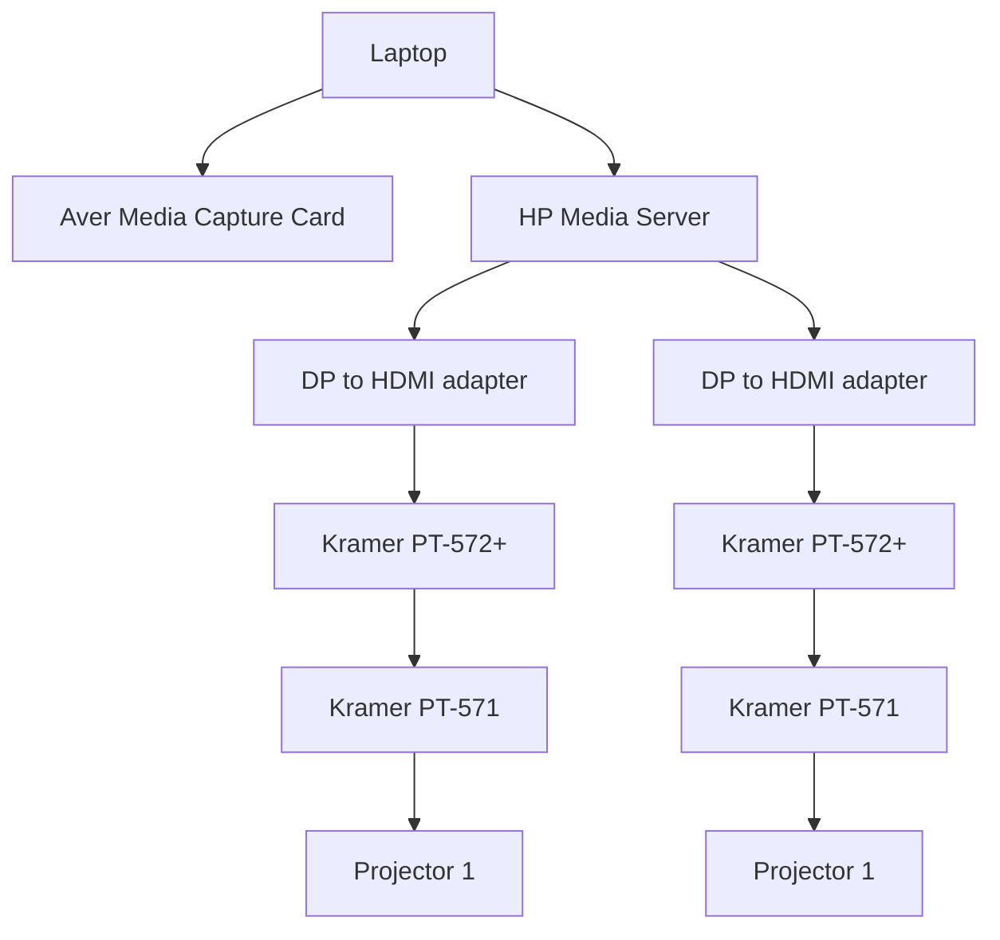
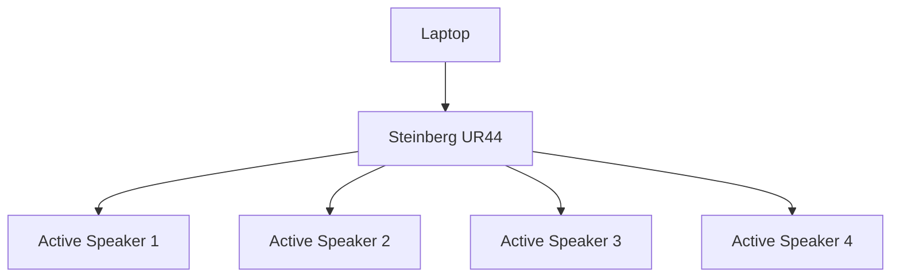
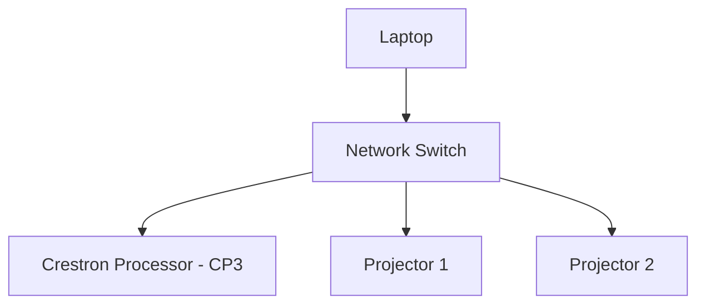
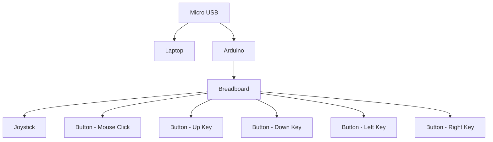

# Gamenian
========
## Types of Coding Language(s)
- C# 
=======
## Game Development
### Two Player Game Code

Game Development Foundation (Completion 100%)
- Connect 4 (*POC*)

Game effects (Completion 100%)
- Connect 4

### Single Player Game Code

Game Development Foundation (Completion 100%)

- 2048 (would need to add the Start and Quit buttons)

Game effects(80% Completion)

- 2048 **(sound effects to be completed)**

=======
## Setup Progress
### Video Setup

### Audio Setup

### Control Setup
#### Projector Control

#### Arudino Control

=======
## ***Installation:***
### **Video**
---

1) *Setup a laptop that has 2 output connections, 1 to Aver Media Capture Card while the other to HP Media Server*

2) *From the media server, there will be 2outputs to 2 different DP to HDMI adapters*

3) *From each adapters output, will be connected to Kramer PT-572+ and Kramer PT-571( transmitter and receiever ) before output to 2 different projectors*

### **Audio**

---
1) *At the same time from the laptop, direct connection to the Steinberg UR44( amplifier)*

2) *From the amplifier, output the cables to 4 different active speakers*

*the images below is connection from amplifier to speakers*

---

* ***Also ensure that the driver is working properly in the amplifier in order to send audio out to the speakers***

=======
## Operational Instructions:
---
### Christie Pandora Box
---
1) *Have a LGX AvaMedia CaptureCard (for livestreaming the game onto the table and screen)*

2) **Install LGX Livestream CaptureCard drive in your laptop in order for the CaptureCard to communicate with the laptop and the media server.**

3) **After downloading Christie Pandora Box, and Christie Pandora Server Management, you would need to have a licence for the pandora box in order to be able to operate it( the licence can be in seperate hard drive like a thumbdrive, though it requires money to buy the licence).**

4) **After having both the licence and the pandora box, open up pandora server management, in it you need to open the media server( if you have direct connection from the laptop to the server with the licence). Ensure that the IP address are in the same subnets for direct commnications on both the media server and the laptop.** 

5) **Afterwards, you can *open the Pandora Box application,both on laptop and in server management,* create new project( ensure that after opening new project, you could see the server icon ). Add the live stream media and video assets needed into the media server, and both the assets needs to be on different layers. From there, the projectors should be able to livestream the output from laptop onto the table/screen.**

6) **Add mesh by right clicking of the folder, rename it for easy recognition, and you will be able to mesh edit your video output to the size of the table/screen that you are projecting them to.**

---
### Unity Hub
---
1) *Install Unity Hub before installing the Zip folder of the game*

2) ***Unzip folder** of the game and opening it in Unity Hub*

3) ***Build and run** the game and you should be good to go*

## Testing Intructions:
### How to play?
---
#### Connect 4
---
* Its a 2 player game( Green and Red )
* They drop the discs into the grid( anywhere in the grid )**{depends on the column they selected}**
* They have to stack their coloured discs vertically, horizontally or diagonally
* First player to get 4 in a row wins the game
* Use the controller provided to move the cursor and select the grid column

### Troubleshooting:
---
#### What if the video is unable to livefeed onto the projector?
---
1) Check the cabling from the CaptureCard to the media server. Change the cable if need to.

2) Check the driver of the CaptureCard to see if they are communicating with each other. If they are not able to communicate, reinstall the driver.

3) If its neither of them, check the pandora box, ensure that the layer that you are projecting out is visible(not hidden).

#### Troubleshooting Audio Setup

1) Ensure the audio cables and power cables are connected properly

2) make sure that the USB cable is plugged in from the UR44 to the computer **(or via usb hub tha was connected to the computer)**

3) Switch on the UR44 power button **(located behind)**

4) Swich on the power for the 4 active speakers **(black 13A POWER STRIP)**

5) Ensure the speaker power button is on and the volume knok is positioned at 12 o clock position

6) Install the drivers for UR44 at the steinberg website

7) Make sure that the main volume is turned to the maximum

8) the ur44 is ready to be used
**(LOWER THE VOLUME FIRST BEFORE TESTING)**