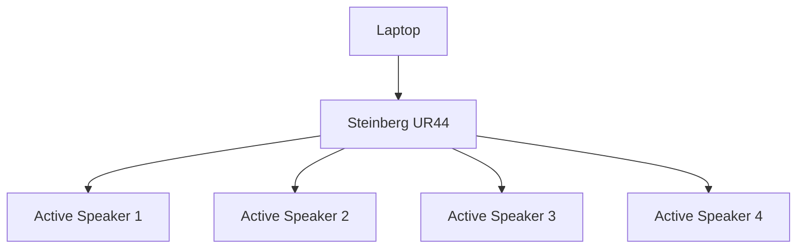
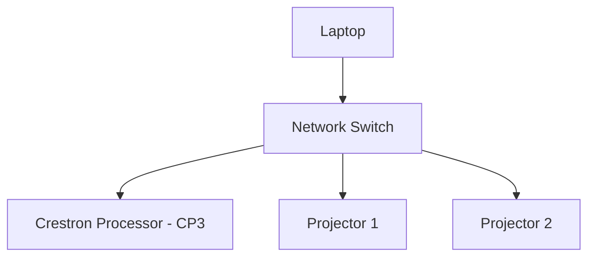
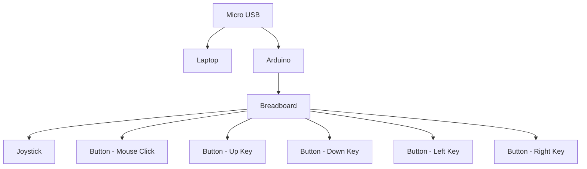

# Gamenian

## Types of Coding Language(s)

- C# 

---

## Game Development

---

### Two Player Game Code

Game Development Foundation (Completion 100%)
- Connect 4 (*POC*)
- Air Hockey **(CANCELLED)**

Game effects (Completion 100%)
- Connect 4

Game Effects for Air Hockey(25% Completion) **{CANCELLED}**

---

### Single Player Game Code

Game Development Foundation (Completion 100%)

- **Buttons(CANCELLED){Compiling error}**

- 2048 (would need to add the Start and Quit buttons)

- Cat Clicker[to replace the Air Hockey game]

Game effects(80% Completion)

- 2048 **(need the movement of the blocks and the game over sound effects)**

- Cat Clicker **(100% Completion)**

<<<<<<< HEAD
## System Diagram

---
=======
>>>>>>> 7c67b005e04433aaeaa93c83d4ef5df245e59572

## Setup Progress
### Video Setup
### Audio Setup

### Control Setup
#### Projector Control

#### Arudino Control

## Installation:

1) *Set up 2projectors(1 for coffee table, 1 for the wall/screen), and ensure that the cables are properly connected to UR44(amplifier) to the speakers from the laptop and properly powered on*
**The cable from the laptop to the amplifier is USB type B to USB type A**

***Also ensure that the driver is working properly in the amplifier for the speaker to be in working condition***

2) *Have a LGX AvaMedia CaptureCard (for livestreaming the game onto the table and screen)*

3) *Ensure that the cables are connected from the laptop that you are going to livestream the game and the media server to the CaptureCard before output it to the 2projectors*

4) *Once that is done,would need to **install Christie Pandora Box with the licence** to do the meshing of the video and dual live output onto the table and screen*

=======
### **Unity Hub**

5) *Install Unity Hub before installing the Zip folder of the game*

6) ***Unzip folder** of the game and opening it in Unity Hub*

7) ***Build and run** the game and you should be good to go*