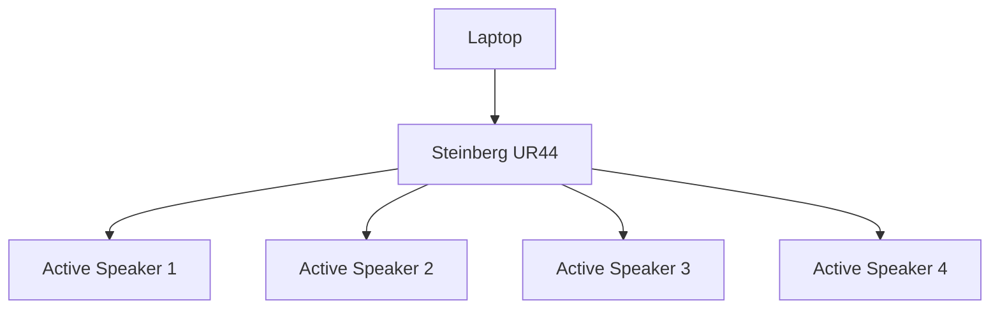
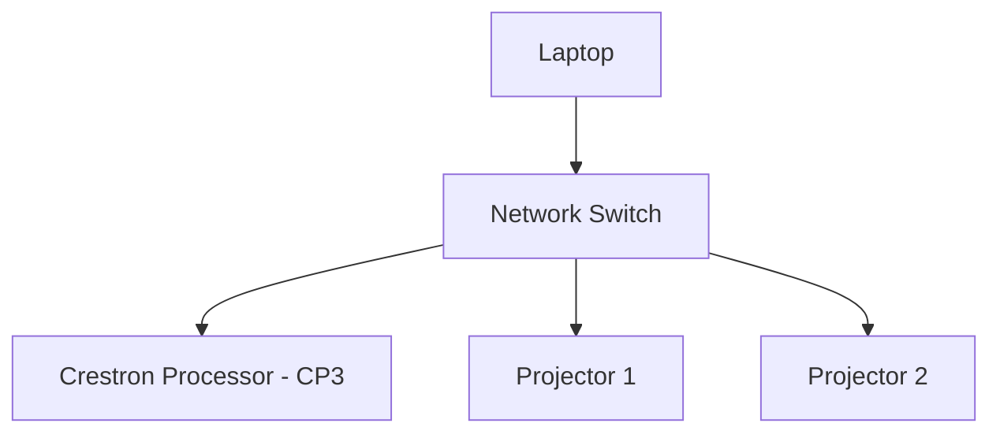
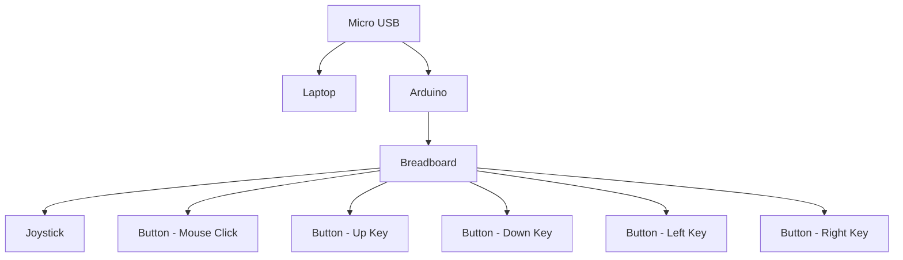
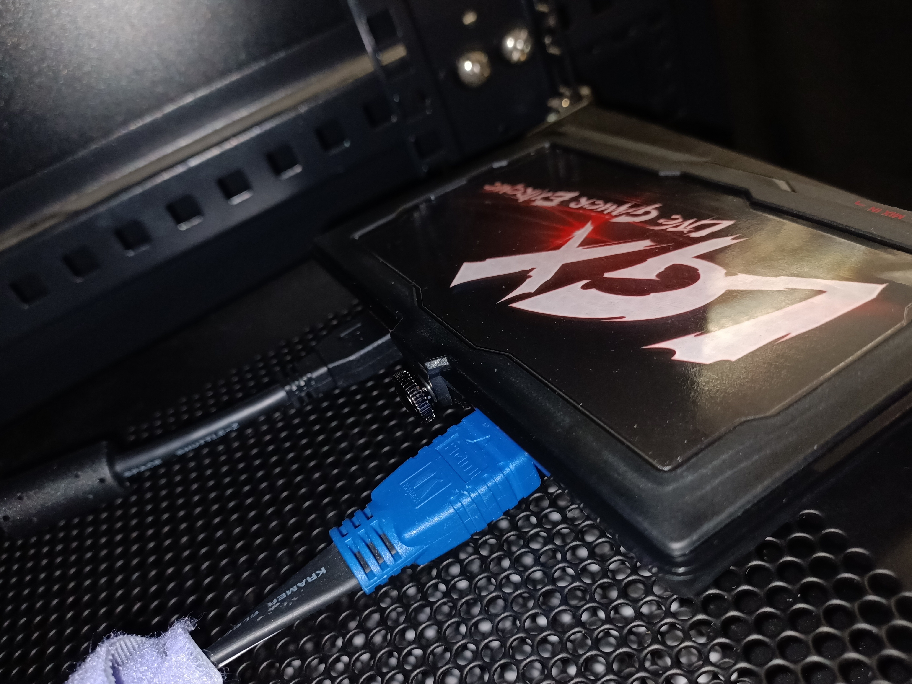

# Gamenian

## Types of Coding Language(s)
- C# 

---
## Game Development
### Two Player Game Code

Game Development Foundation (Completion 100%)
- Connect 4 (*POC*)

Game effects (Completion 100%)
- Connect 4

### Single Player Game Code

Game Development Foundation (Completion 100%)

- 2048 (would need to add the Start and Quit buttons)

Game effects(80% Completion)

- 2048 **(sound effects to be completed)**
---
## Setup Progress
### Video Setup

### Audio Setup

### Control Setup
#### Projector Control

#### Arudino Control

## Installation phase

### Video Installation
---
1) In our setup, we have 2 projectors setup(1 for table, 1 for the projection screen)

---

---

2) The position of the projector for the table is faced down while the projector for the projection screen is faced forward.

---

---

3) 
Both projectors would be connected to the media server via HDMI.
We required the use of 2 DP to HDMI Adapters as the server only accepts DP and we only had HDMI cables.

---

---

4) Due to the distance of the projector and media server being a few meters away from each other, we used 2 pairs of 
   HDMI extenders to increase the reach for the HDMI cables.

---

---

5) Next, we would connect the media server to the laptop via LAN to project out our content.

---

---

5) In our setup, we will be using a capture card(Aver Media) connected via USB-A to USB Micro B to the media server and 
   laptop as we will be live streaming our content through christie pandora box(Projection mapping software).

---

---

6) In order to use christie pandora box, we require a dongle(License to use pandora box) for the media server and the laptop.

---

---

### Audio Installation
---
1) In our setup, we are using 4 active speakers. These speakers are placed below the table.

2) As active speakers require power to be used, we will be plugging in IEC to 13A plug to a power strip.

---

---

3) To project sound out from the speakers from the laptop, we will be using the Steinberg UR44(Audio Interface).

---

---

3) The speakers are connected to the Steinberg UR 44 via TS 1/4 inch to XLR Cable.

---

---

4) The Steinberg UR44 is connected to the Laptop via USB-A to USB-B.

5) All power strips, active speakers and the Steinberg UR44 power should all be switched on.
     * The active speaker power button is located at the back of the speaker
     * The Steinberg UR44 power button is loacted at the back of the audio interface

6) To turn up the volume, simply slowly increase the laptop volume as well as make sure that the volume knob of the speakers are positioned in the 12 o'clock position.

---

---

### Arduino Leonardo
1) To use the Arduino Leonardo, connect it via USB-A to Micro USB to the Laptop.

2) In our set up, we have connected one joystick and 5 buttons to out Arduino.

## Operational Phase
---
### Christie Pandora Box
---
1) *Have a LGX Aver Media Capture Card (for livestreaming the game onto the table and screen)*

2) **Install LGX Livestream CaptureCard drive in your laptop in order for the CaptureCard to communicate with the laptop and the media server.**

3) **After downloading Christie Pandora Box, and Christie Pandora Server Management, you would need to have a licence for the pandora box in order to be able to operate it( the licence can be in seperate hard drive like a thumbdrive, though it requires money to buy the licence).**

4) **After having both the licence and the pandora box, open up pandora server management, in it you need to open the media server( if you have direct connection from the laptop to the server with the licence). Ensure that the IP address are in the same subnets for direct commnications on both the media server and the laptop.** 

5) **Afterwards, you can *open the Pandora Box application,both on laptop and in server management,* create new project( ensure that after opening new project, you could see the server icon ). Add the live stream media and video assets needed into the media server, and both the assets needs to be on different layers. From there, the projectors should be able to livestream the output from laptop onto the table/screen.**

6) **Add mesh by right clicking of the folder, rename it for easy recognition, and you will be able to mesh edit your video output to the size of the table/screen that you are projecting them to.**

---
### Unity Hub
---
1) *Install Unity Hub before installing the Zip folder of the game*

2) ***Unzip folder** of the game and opening it in Unity Hub*

3) ***Build and run** the game and you should be good to go*

---
### Audio Software Installation
---
1) To use the Steinberg UR44, you would be required to download the specific driver from their website

2) To download the driver, click on this link below:
<a href>https://o.steinberg.net/en/support/downloads_hardware/downloads_ur44.html</a>

3) In the webpage, find "Tools for UR44"

4) Under that tab, find for "Tools for UR44 V2.2.2" for Window users or "Tools for UR44 V2.3.0" for MAC Users and click to download

### Arduino Leonardo
#### Download Arduino Sofware
1) To start on the Arduino, search in Google for Arduino IDE

2) Click on Download and Install Arduino IDE
<a href>https://support.arduino.cc/hc/en-us/articles/360019833020-Download-and-install-Arduino-IDE</a>

3) In the webpage under Installation Instructions, download the relevant IDE depending on the OS system you are using

4) You can now start programming your Arduino!

#### Arduino mouse and keyboard controls
1) In your Arduino Leonardo, start by downloading the mouse and keyboard library

2) To start off the code, we sourced for codes from the Arduino website as well as other webpages too. 
   We then edited the code depending on what we have connected to our Arduino.

3) First, we tested out the mouse control as well as the mouse click codes.

4) We then tested out the keyboard control code to check if the buttons that we want to use is synced with the Arduino buttons.

5) We then combined the codes together and tested them out to see if the codes would conflict with one another.

3) To take note: Remember to always include the relevant library or the code will not work

## Testing Phase
---
#### Connect 4
---
* Its a 2 player game.
* Players are given a controller to play the game.
* To play, players would be required to click in any of the columns in the provided grid to drop their coloured discs.
---
<a href>https://github.com/AbbieNgXinYi/Gamenian/blob/main/Connect4img/takeTurns.mp4</a>
---

* To win the game, the first player that gets 4 in a row, vertically, horizontally or diagonally, wins the game.
---

---
* To restart the game, click on the start button
---

---

* To quit the game, click on the quit button
---

---

### Troubleshooting:
---
#### What if the video is unable to livefeed onto the projector?
---
1) Check the cabling from the CaptureCard to the media server. Change the cable if need to.

2) Check the driver of the CaptureCard to see if they are communicating with each other. If they are not able to communicate, reinstall the driver.

3) If its neither of them, check the pandora box, ensure that the layer that you are projecting out is visible(not hidden).

