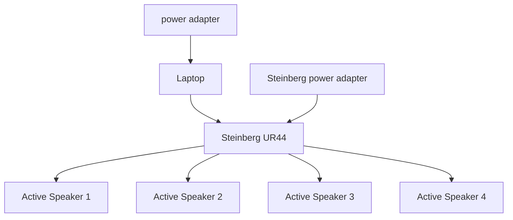

# Gamenian

## Types of Coding Language(s)

- C# 

---

## Game Development

---

### Two Player Game Code

Game Development Foundation (Completion 100%)
- Connect 4 (*POC*)
- Air Hockey **(CANCELLED)**

Game effects (Completion 100%)
- <span style="color:lightgreen">Connect 4</span>

Game Effects for Air Hockey(25% Completion) **{CANCELLED}**

---

### Single Player Game Code

Game Development Foundation (Completion 100%)

- **Buttons(CANCELLED){Compiling error}**

- <span style="color:red">2048 (would need to add the Start and Quit buttons)</span>

- Cat Clicker[to replace the Air Hockey game]

Game effects(80% Completion)

- <span style="color:red">2048 **(need the movement of the blocks and the game over sound effects)**</span>

- <span style="color:lightgreen">Cat Clicker **(100% Completion)**</span>


## Setup Progress
### Audio Setup

### Audio Setup
```mermaid
graph TD

A[power adapter]--> B[Laptop]
B--> C[Network Switch]
C--> D[Crestron Processor (CP3)]
C--> E[Wireless Router]
C--> F[Projector 1]
C--> G[Projector 2]

```


## Installation:

### Unity Hub

1) *Install Unity Hub before installing the Zip folder of the game*

2) *Unzip folder of the game and opening it in Unity Hub*

3) *Build and run the game and you should be good to go*