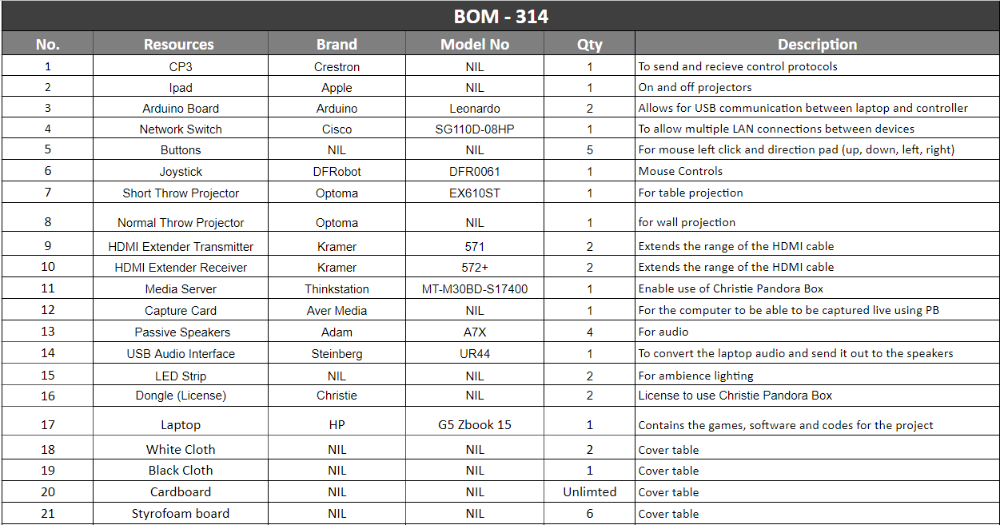
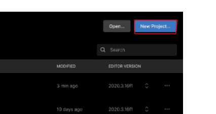

# Gamenian

## Team Information

**Abbie(Leader)**

* Arduino Programming - Joystick and Buttons Control
* Joystick and Buttons Hardware Interfacing to Arduino
* Unity Code editing, Arduino Communication
* PB Meshing - Table and Screen Projection

**Sean(Assistant Leader)**

* Arduino Programming - Joystick and Buttons Control
* Joystick and Buttons Hardware Interfacing to Arduino
* Unity Code editing, Arduino Communication
* Video System setup

**William(Member)**

* Video System setup
* Aduio System setup
* Live Streaming setup for PB

**Xin Yi(Member)**

* PB Meshing - Table and Screen Projection
* Unity Code GUI editing

## Project Information

### Objective

**To give existing furniture more features:**

* Allow users to be able to entertain a big group of people
* Diverse usage of the same furniture
* Help to save space


## Types of Coding Language(s)

- C#

---

## Game Development

### Two Player Game Code

Game Development Foundation (Completion 100%)
* Connect 4 (*POC*)

Game effects (Completion 100%)
* <span style="color:lightgreen">Connect 4</span>

### Single Player Game Code

Game Development Foundation (Completion 100%)

* <span style="color:red">2048 (would need to add the Start and Quit buttons)</span>

Game effects(80% Completion)

* <span style="color:red">2048 **(sound effects to be completed)**</span>

---

## Setup Progress

### Bill Of Materials



### Video Setup


### Audio Setup


### Control Setup

#### Projector Control


#### Arudino Control


#### Network Settings


### Floor & Cabling Plan


<br>


<br>


<br>


### Cabling Layout


### Rack layout
* This is our rack layout. The media server is placed at the bottom with the amplifier.


* Followed by the Live Avermedia Capture Card on the second layer

* The laptop is placed at the topmost of the layer.


---

## Installation phase

### Video Installation

1) In our setup, we have 2 projectors setup(1 for table, 1 for the projection screen)


2) The position of the projector for the table is faced down while the projector for the projection screen is faced forward.


3) Both projectors would be connected to the media server via HDMI.
   We required the use of 2 DP to HDMI Adapters as the server only accepts DP and we only had HDMI cables.


4) Due to the distance of the projector and media server being a few meters away from each other, we used 2 pairs of
   HDMI extenders to increase the reach for the HDMI cables.


5) Note: HDMI Extenders help ensure proper and stable cable management
    * Help reduce hardware issues that relate to the cabling like:
        1) lose connection
        2) Cable being pulled out
    * Extenders run on LAN cables for extension
        1) LAN cables have a locking mechanism while HDMI cables do not. This ensures that aren't lose or pulled out easily.

6) Next, we would connect the media server to the laptop via LAN to project out our content.


7) In our setup, we will be using a capture card(Aver Media) connected via USB-A to USB Micro B to the media server and
   laptop as we will be live streaming our content through christie pandora box(Projection mapping software).


8) In order to use christie pandora box, we require a dongle(License to use pandora box) for the media server and the laptop.


**Media Server**


<br>

**Laptop**


### Audio Installation

1) In our setup, we are using 4 active speakers. These speakers are placed below the table.

2) As active speakers require power to be used, we will be plugging in IEC to 13A plug to a power strip.


4) To project sound out from the speakers from the laptop, we will be using the Steinberg UR44(Audio Interface).


5) The speakers are connected to the Steinberg UR 44 via TS 1/4 inch to XLR Cable.


6) The Steinberg UR44 is connected to the Laptop via USB-A to USB-B.

7) All power strips, active speakers and the Steinberg UR44 power should all be switched on.
     * The active speaker power button is located at the back of the speaker
     * The Steinberg UR44 power button is loacted at the back of the audio interface

8) To turn up the volume, simply slowly increase the laptop volume as well as make sure that the volume knob of the speakers are positioned in the 12 o'clock position.


### Arduino Leonardo

<br>


<br>

1) To use the Arduino Leonardo, connect it via USB-A to Micro USB to the Laptop.

2) We have used a passive USB extender due to the location of where our Laptop and Arduino is placed.

3) In our set up, we have connected one joystick and 5 buttons to our Arduino using 3 core cables and jumper wires.

<br>

**Arduino Setup**


**Joystick and Button Setup**


---

## Operational Phase

### PB Management

1) Download PB management application. Note that you would need to obtain a license to use the software.

2) In the PB management workspace, wait for the server icon to turn **blue** and its state to say **online**
   before clicking the icon.

   

3) After clicking on the icon, you would be directed to an interface called the **PB Menu** with different applications.

4) In PB Menu, click on **Pandora Box**.

   

5) You would be shown a client interface. In that page, click on **Full Screen**.

   

### Aver Media Capture Card

1) In our setup, we are using a **Capture Card** to live stream our game through **Christie Pandora Box**.

2) We are using the LGX Aver Media Capture Card.

3) For this Capture Card, you would need to install the LGX Livestream CaptureCard drive in your laptop in order for the CaptureCard to communicate with the laptop and the media server.

### Christie Pandora Box

1) To use Christie pandora box, you would need to download both the Christie pandora box and PB management application. You would also need to obtain a license(Dongle) to use the software.

2) If all requirements have been fulfilled, you may procced to plug in the dongle that contains the license to use the application into either the laptop if running on local, or a media server if u have one. Ensure that the IP address of the laptop is the same as the PB management too.

3) For the Pandora Box application, simply create a new project to start off.

4) Find and click on the capture card name in the **assets tab** in the application.

5) In the capture card tab, find and click on **StreamiX live input**. In **StreamiX live input**, find the input with the name of the capture card that you are using and drag the input into a layer in the timeline.

6) As this software is a projection software, we can also add something called **editable mesh**, to help us size and fit our content depending on our display area. Right click on your project folder and click on **Add Editable Mesh**. You may rename the mesh to your liking.

---

### Unity Hub

#### Starting on Unity Hub

1) Install Unity Hub from their official site. Here is the link to download Unity Hub into your devices. Select either Windows or Mac.**[Depending on your devices]**

<https://unity.com/download>

2) After downloading and installing Unity Hub into your device, boot it up

3) After opening Unity Hub, you should see this screen below.

   

4) Sign in if you already have an account before. If not, create a unity account.

   

<br>

   

5) Once you have sign in with your account, you should see this interface.

   

6) To start creating your game, click on **New Project**. You may rename the project to your liking.

   

7) For our games, we are using the 2D option. The option you choose depends on the type of game you are creating.

   

8) Once you have decided what kind of game you ae making, click on **Create Project**

   

#### Building your game

1) Once you are done with your game creation, to use it as an application, you would need to build your game.

1a) Firstly, click on **file**

   

1b) Secondly, find and click on **Build Settings**  

   

2) Before building your game, check your build settings first before clicking on **Build and Run**.

2a) Firstly, check which platform you are going to build your game with.
    In our case, the platform we have used is **Windows, Mac, Linux**.

   

2b) Secondly, in **Scenes in Build**, remember to uncheck the **Scenes/SampleScene**.

   

2c) If you don't, you will be presented with a blue screen instead.

   

3) After you have check your **Build Settings**, you may now click on **Build and Run**.

   

4) Once your game is build, you should see your game interface if all settings are as followed.

   

---

### Audio Software Installation

1) To use the Steinberg UR44, you would be required to download the specific driver from their website

2) To download the driver, click on this link below:

<https://o.steinberg.net/en/support/downloads_hardware/downloads_ur44.html>

<br>


3) In the webpage, find "Tools for UR44"

4) Under that tab, find for "Tools for UR44 V2.2.2" for Window users or "Tools for UR44 V2.3.0" for MAC Users and click to download

### Arduino Leonardo

#### Download Arduino Sofware

1) To start on the Arduino, search in Google for Arduino IDE

2) Click on Download and Install Arduino IDE

<https://support.arduino.cc/hc/en-us/articles/360019833020-Download-and-install-Arduino-IDE>

3) In the webpage under Installation Instructions, download the relevant IDE depending on the OS system you are using

4) You can now start programming your Arduino!

#### Arduino mouse and keyboard controls

1) In your Arduino Leonardo, start by searching and downloading the **mouse and keyboard library**

2) To start off the code, we sourced for codes from the Arduino website as well as other webpages too.
   We then edited the code depending on what we have connected to our Arduino.

3) First, we tested out the mouse control as well as the mouse click codes.

4) We then tested out the keyboard control code to check if the buttons that we want to use is synced with the Arduino buttons.

5) We then combined the codes together and tested them out to see if the codes would conflict with one another.

6) Our codes can be found in **Arduino Codes** folder.

* To take note: **Remember to always include the relevant library or the code will not work**

   ```
   #include "Keyboard.h"
   #include "Mouse.h"
   ```

## Testing Phase

### Connect 4 (Game Demo)

* Its a 2 player game.
* Players are given a controller to play the game.
* To play, players would be required to click in any of the columns in the provided grid to drop their coloured discs.

<https://github.com/AbbieNgXinYi/Gamenian/blob/main/Connect4img/takeTurns.mp4>

* To win the game, the first player that gets 4 in a row, vertically, horizontally or diagonally, wins the game.

---


---

* To restart the game, click on the start button

---


---

* To quit the game, click on the quit button

---


---

### Joystick and Button Demo


### Troubleshooting

#### What if the video is unable to livefeed onto the projector?

* Check the cabling from the CaptureCard to the media server. Change the cable if need to.
* Check the driver of the CaptureCard to see if they are communicating with each other. If they are not able to communicate, reinstall the driver.
* If its neither of them, check the pandora box, ensure that the layer that you are projecting out is visible(not hidden).

#### Aver Media Capture Card

* Check if the Capture Card LED if lit Blue

* If not lit blue but red:
   1) Check the USB and HDMI cables - change if necessary
   2) Check for lose cable connection
   3) Check if cable is connected to the right source
      * If using media server, USB cable plug to Media server, not laptop
      * Not using media servr, USB plug to Laptop

#### PB Management

* If you press **X** on the client interface and when you press Pandora Box and it says it is open when you have closed it:
    1) Find **Taskbar** and switch it on
    2) Now, you should be able to see the taskbar in your PB Menu page
    3) Find the Pandora Box tab and click on it to get back the Pandora Box client interface

* Ensure that the IP address of the laptop is the same as the PB management too.

#### Christie Pandora Box

* Make sure that dongle is plugged in either in the server or laptop

* If the projector has been switched on and off, and content is not displayed:
   1) Save your file first
   2) Close **Christie Pandora Box** and in PB management, click on **disconnect**
   3) After you have disconnected, you may either:
      * Close the whole PB Management
      <br> OR
      * Right Click on the box which says Server[Number depends on how many servers you have]
      * Find **System** and in that tab, click on **Reboot**

* If you are unable to preview your content in pandora box:
   1) Make sure that you have clicked on **toggle preview**
   2) In pandora box find and click on **all cameras**

* If you can't find your mesh:
    1) In pandora box find and click on **all cameras**
    2) Check which **layer output** you are on

#### Arduino

* Check the IDE software if its affecting the arduino

* If unable to download code due to software:
   1) Save your code first
   2) Uninstall IDE and reinstall it

* Check if Arduino is online or offline

* If offline:
   1) Check the port - check if you have connected to the port
   2) Check if you have connected to the correct Arduino

* If not software issue, check whether your Arduino is corrupted. If hardware issue, change it.

#### Unity Hub

* Remember to uncheck the **Scenes/SampleScene**

   

* If you uncheck the box, you will be given a blue screen instead of the game interface

   
