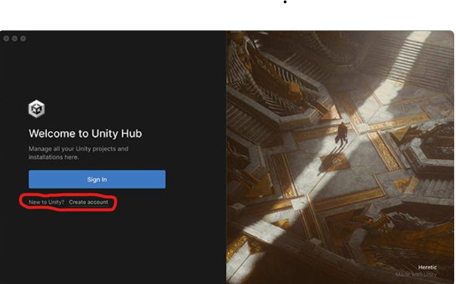

# Gamenian

## Project Information

### Background :

With housing in Singapore being smaller and increasingly more expensive recently, many are looking for ways to save space and make things more compact.

With our project, we aim to help tackle some of these issues and add value to existing furnishings that people already have.

---

## Table of Content :

- **[Our Objective](#Our-Objective)**

- **[Unique Features](#Unique-Features)**

- **[Team Information](#Team-Information)**

- **[Game Coding Language(s)](#Game-Coding-Language(s))**

- **[Game Development](#Game-Development)**
   - Two-Player Games
   - Single-Player Games

- **[Setup Progress](#Setup-Progress)**
   - Bill Of Materials (BOM)
   - Video Setup
   - Audio Setup
   - Control Setup
      - Projector Setup
      - Arduino Setup

- **[Network Settings](#Network-Settings)**

- **[Floor and Cabling Plan](#Floor-and-Cabling-Plan)**
   - Layout
      - Cabling Layout
      - Rack Layout

- **[Installation Phase](#Installation-Phase)**
   - Video Installation
      - Media Server
      - Laptop
   - Audio installation
      - Audio Software 
   - Arduino Leonardo
      - Arduino Setup
      - Arduino Software
         - Arduino mouse and keyboard controls
   - Joystick and Buttons Setup

- **[Operational Phase](#Operational-Phase)**
   - PB Management
   - Aver Media Capture Card
   - Christie Pandora Box
   - Unity Hub
      - Starting Unity hub
      - build your Game
   - Configuring Network of DMP 64
   - DMP 64 presets

- **[Testing Phase](#Testing-Phase) (With Instructions and Demo)**
   - Connect 4
   - 2048 
   - Ping Pong
   - Joystick and Button Demo

- **[Troubleshooting](#Troubleshooting)**
   - What if the video is unable to livefeed onto the projector?
   - Aver Media Capture Card
   - PB Management
   - Christie Pandora Box
   - Arduino
   - Unity Hub


## Our Objective
**[(Back To Top)](#top)**

**To give existing furniture more features:**

* Allow users to be able to entertain a big group of people
* Diverse usage of the same furniture
* Help to save space

## Unique Features
**[(Back To Top)](#top)**

* Players are able to concentrate on the game that is one the table while the audience can enjoy 
  spectating the game by watching the gameplay on the second output(wall)

* Setup compacts features into the area of the table which helps to save space especially in newer, smaller houses. 
   It also adds value to the furniture as the same piece of furniture can have more uses


## Team Information
**[(Back To Top)](#top)**

### These are the Team Members that worked together to make a functioning project:

**Abbie(Leader)**

* POC Phase
   + Arduino Programming - Joystick and Buttons Control
   + Joystick and Buttons Hardware Interfacing to Arduino
   + Unity Code editing, Arduino Communication
   + PB Meshing - Table and Screen Projection

* MVP Phase
   + Communication between Joystick & Laptop - 2 players setup  
   + Audio system setup - DSP + ceiling speakers
   + Audio DSP Configuration
   + Control System setup
   + Control system - Audio DSP & Projector control 

**Sean(Assistant Leader)**

* POC Phase
   + Arduino Programming - Joystick and Buttons Control
   + Joystick and Buttons Hardware Interfacing to Arduino
   + Unity Code editing, Arduino Communication
   + Video System setup

* MVP Phase
   + Communication between Joystick & Laptop - 2 players setup
   + Audio system setup - DSP + ceiling speakers
   + Control System setup


**William(Member)**

* POC Phase
   + Video System setup
   + Aduio System setup
   + Live Streaming setup for PB

* MVP Phase
   + Lighting System Setup
   + Lighting System Programming, Cue-ing

**Xin Yi(Member)**

* POC Phase
   + PB Meshing - Table and Screen Projection
   + Unity Code GUI editing

* MVP Phase
   + Unity code - incorporate new game (Ping Pong) to replace Air Hockey 
   + Incorporate Main Menu 
   + Game instructions - asset creation

## Game Coding Language(s)
**[(Back To Top)](#top)**

* C#

---

## Game Development
**[(Back To Top)](#top)**

### Two Player Game:

Game Development With SFX (Completion 100%)
* Connect 4 
* Ping Pong Game

### Single Player Game:

Game Development With SFX (Completion 100%)

* 2048

---

## Setup Progress
**[(Back To Top)](#top)**

### Bill Of Materials


### Video Setup


### Audio Setup


### Lighting Setup


### Control Setup

#### Equipment Control


#### Arudino Control


#### Network Settings
**[(Back To Top)](#top)**

| Device | IP Address | Subnet Mask | Default Gateway |
| --- | --- | --- |  --- |
| **Router** | 192.168.77.7 | 255.255.255.0 | 192.168.1.1 |
| **Laptop** | 192.168.77.100 | 255.255.255.0 | 192.168.77.7 |
| **IPCP Pro 350** | 192.168.77.15 | 255.255.255.0 | 192.168.77.7 |
| **Optoma Projector** | 192.168.77.16 | 255.255.255.0 | 192.168.77.7 |
| **Media Server (ThinkServer)** | 192.168.77.30 | 255.255.255.0 | 192.168.77.7 |
| **DMP 64** | 192.168.77.11 | 255.255.255.0 | 192.168.77.7 |


### Floor & Cabling Plan
**[(Back To Top)](#top)**


<br>


<br>


<br>


### Cabling Layout


### Rack layout


---

## Installation phase
**[(Back To Top)](#top)**

### Lighting Installation
1) In this setup, we use LED Strips to hang up on top of of the metal truss to light up the area.


2)The LED Strips was connected using FlexOled LEDJ FTP3 driver. This driver have to set to the correct DMX address by pushing up the correct slider (Eg if the DMX address is 451 switch the slider 1,2,7, 8, and 9 to the ON position)


3) The LED Driver was connected to the grandMA3 onPC 2K node via the DMX to terminal block cable. The grandMA3 onPC software is required to control and set the lighting cues and the effects for the LED Strips.


4)The grandMA3 software can be downloaded in the website via this link 
:https://www.malighting.com/downloads/products/grandma3/

### Video Installation
**[(Back To Top)](#top)**

1) In our setup, we have 2 projectors setup(1 for table, 1 for the projection screen)


2) The position of the projector for the table is faced down while the projector for the projection screen is faced forward.


3) Both projectors would be connected to the media server via HDMI.
   We required the use of 2 DP to HDMI Adapters as the server only accepts DP and we only had HDMI cables.


4) Due to the distance of the projector and media server being a few meters away from each other, we used 2 pairs of
   HDMI extenders to increase the reach for the HDMI cables.


5) Note: HDMI Extenders help ensure proper and stable cable management
    * Help reduce hardware issues that relate to the cabling like:
        1) lose connection
        2) Cable being pulled out
    * Extenders run on LAN cables for extension
        1) LAN cables have a locking mechanism while HDMI cables do not. This ensures that aren't lose or pulled out easily.

6) Next, we would connect the media server to the laptop via LAN to project out our content.


7) In our setup, we will be using a capture card(Aver Media) connected via USB-A to USB Micro B to the media server and
   laptop as we will be live streaming our content through christie pandora box(Projection mapping software).


8) In order to use christie pandora box, we require a dongle(License to use pandora box) for the media server and the laptop.


**Media Server**


<br>

**Laptop**


### Audio Installation
**[(Back To Top)](#top)**

1) In our setup, we are using 2 ceiling speakers, 1 DMP 64 - audio DSP, and 1 XPA 1002 audio amplifier.

2) Firstly, connect the DMP 64 to the laptop via LAN. 
   **(In our project, as we do not have enough LAN ports, we will be using a network switch.)**

3) Secondly, connect the DMP 64 outputs that will be used to the corresponding XPA 1002 inputs via speaker/mic/LAN cable.


### Control Installation
**[(Back To Top)](#top)**

1) In our setup, you will need 1 Laptop, 1 Control Processor (IPCP Pro 350).

2) To be able to program for our equipment controls, the control processor is needed.

3) To use the control processor, simply connect it to the laptop via LAN.
   **(In our project, as we do not have enough LAN ports, we will be using a network switch.)**


### Arduino Leonardo
<br>

**[(Back To Top)](#top)**


<br>

1) To use the Arduino Leonardo, first connect it via USB-A to Micro USB to the Laptop.

2) For our setup, we have used a passive USB extender due to the location of where the Laptop and Arduino is placed.

3) In our set up, we have connected one joystick and 5 buttons to the Arduino using 3 core cables and jumper wires.

<br>

**Arduino Setup**


#### Download Arduino Sofware

1) To start on the Arduino, search in Google for Arduino IDE

2) Click on Download and Install Arduino IDE

<https://support.arduino.cc/hc/en-us/articles/360019833020-Download-and-install-Arduino-IDE>

3) In the webpage under Installation Instructions, download the relevant IDE depending on the OS system you are using

4) You can now start programming your Arduino!

#### Arduino mouse and keyboard controls

1) In your Arduino Leonardo, start by searching and downloading the **mouse and keyboard library**

2) To start off the code, we sourced for codes from the Arduino website as well as other webpages too.
   We then edited the code depending on what we have connected to our Arduino.

3) First, we tested out the mouse control as well as the mouse click codes.

4) We then tested out the keyboard control code to check if the buttons that we want to use is synced with the Arduino buttons.

5) We then combined the codes together and tested them out to see if the codes would conflict with one another.

6) Our codes can be found in the **Arduino Codes** folder.

* To take note: **Remember to always include the relevant library or the code will not work**

   ```
   #include "Keyboard.h"
   #include "Mouse.h"
   ```

**Joystick and Button Setup**


---

## Operational Phase
**[(Back To Top)](#top)**

### PB Management

1) Download PB management application. Note that you would need to obtain a license to use the software.

2) In the PB management workspace, wait for the server icon to turn **blue** and its state to say **online**
   before clicking the icon.

   

3) After clicking on the icon, you would be directed to an interface called the **PB Menu** with different applications.

4) In PB Menu, click on **Pandora Box**.

   

5) You would be shown a client interface. In that page, click on **Full Screen**.

   

### Aver Media Capture Card

1) In our setup, we are using a **Capture Card** to live stream our game through **Christie Pandora Box**.

2) We are using the LGX Aver Media Capture Card.

3) For this Capture Card, you would need to install the LGX Livestream CaptureCard drive in your laptop in order for the CaptureCard to communicate with the laptop and the media server.

### Christie Pandora Box

1) To use Christie pandora box, you would need to download both the Christie pandora box and PB management application. You would also need to obtain a license(Dongle) to use the software.

2) If all requirements have been fulfilled, you may procced to plug in the dongle that contains the license to use the application into either the laptop if running on local, or a media server if u have one. Ensure that the IP address of the laptop is the same as the PB management too.

3) For the Pandora Box application, simply create a new project to start off.

4) Find and click on the capture card name in the **assets tab** in the application.

5) In the capture card tab, find and click on **StreamiX live input**. In **StreamiX live input**, find the input with the name of the capture card that you are using and drag the input into a layer in the timeline.

6) As this software is a projection software, we can also add something called **editable mesh**, to help us size and fit our content depending on our display area. Right click on your project folder and click on **Add Editable Mesh**. You may rename the mesh to your liking.

---

### Unity Hub
**[(Back To Top)](#top)**

#### Starting on Unity Hub

1) Install Unity Hub from their official site. Here is the link to download Unity Hub into your devices. Select either Windows or Mac.**[Depending on your devices]**

<https://unity.com/download>

2) After downloading and installing Unity Hub into your device, boot it up

3) After opening Unity Hub, you should see this screen below.

   

4) Sign in if you already have an account before. If not, create a unity account.

   

<br>

   

5) Once you have sign in with your account, you should see this interface.

   

6) To start creating your game, click on **New Project**. You may rename the project to your liking.

   

7) For our games, we are using the 2D option. The option you choose depends on the type of game you are creating.

   

8) Once you have decided what kind of game you ae making, click on **Create Project**

   

#### Building your game

1) Once you are done with your game creation, to use it as an application, you would need to build your game.

1a) Firstly, click on **file**

   

1b) Secondly, find and click on **Build Settings**  

   

2) Before building your game, check your build settings first before clicking on **Build and Run**.

2a) Firstly, check which platform you are going to build your game with.
    In our case, the platform we have used is **Windows, Mac, Linux**.

   

2b) Secondly, in **Scenes in Build**, remember to uncheck the **Scenes/SampleScene**.

   

2c) If you don't, you will be presented with a blue screen instead.

   

3) After you have check your **Build Settings**, you may now click on **Build and Run**.

   

4) Once your game is build, you should see your game interface if all settings are as followed.

   


### Configuring Network of DMP 64
**[(Back To Top)](#top)**

**This step is to help you configure the DMP 64 if you are using your own network or also which to create your own controls through the extron DSP configurator:**

1) Download the Extron DSP Configurator.

2) Connect the DMP 64 to the laptop via mini USB.

3) Open up the Extron DSP Configurator and choose the appropiate device. In our case, it would be DMP 64.


4) Find the button which says **Live** and click on it.


5) Under **Connect to device...** find and click on the USB tab if not on that tab.


6) Next, select the appropiate device and click **OK**.

7) Next, choose the option where it says **Pull Data...** and click on **OK**


8) Find the **Tools** Tab and find **Device Settings** and click it.


9) You will be directed to a page where you will be able to edit your IP Address. 

10) Once you have edited your IP Address, click on **OK** and your good to go.


### DMP 64 presets
**[(Back To Top)](#top)**

The DMP 64 presets are for the user to be able to control the audio that is being played from the laptop.
The presets that we will be setting are for audio mute and unmute.

1) Make sure that you are in **Live** mode and **not Emulate**.


2) First we would need to route our audio. 

The routing of the audio depends on your connection of your audio amplifier to the DMP 64.
For this project, the inputs and outputs we have used are 1 & 2. 
Our input 1 is routed to ouput 1 and the same goes for input and output 2.


3)Secondly, select the device used in your input and output.

To select the device, click on the number and the **Buliding Blocks** interface will show up.
In the **Buliding Blocks** interface, click on the appropiate folder and device in the folder.

**Input Selection**


**Output Selection**

.png)

3) Once you have selected, click on the **dark grey box** and **rename** the input and output to the device you are using for easier reference.


4) Lastly, save your file. 


With that, you are doing creating a preset. 
To create a preset for audio mute, simply uncheck the routing points and save your preset.

To recall a preset, find the Tab which says **Preset**.
In the dropdown menu, find for the preset which you wish to edit and click on **recall**.


### Configure Control Processor
**[(Back To Top)](#top)**

Here are the steps to configure your Processor if you have used your own AV Network.
In this project, we the processor we have used is the Extron IPCP Pro 350. Thus, we will be using the Extron software to configure our processor.

1) Download the Extron Toolbelt.

2) Connect your Processor to the Laptop via LAN.

3) Open up the Extron Toolbelt sofware, and click on **Discovery**.


4) Once the device appears, click on the **Discovery** button again to uncheck the button.

5) Next click on the device IP Address.

Your device information should be visible to you once you have clicked on the device IP Address.


6) Find the **Network** Tab and click on it. In the **Network** Tab, you will be able to change your device IP Address.


### Extron GCP and GUI Designer
**[(Back To Top)](#top)**

To program our controls, we will be using the Extron GCP and GUI Designer. We are using Extron softwares as our control processor is an Extron device. 

#### Extron GUI Designer

1) Download Extron GUI Designer

To start off, we will design our controls in the Extron GUI Designer.
Once you have open Extron GUI Designer, find the **File** Tab and click on **New Project**


2) Choose your Interface

In this project, we will be using the interface for iOS.
Once you have the selected the appropiate interface, click on create.


3) Start Designing your interface - Basic Designing

For this project, we will be learning to design a basic interface. 
For our interface, we will only be designing with Buttons and Labels. We will be designing for our projector controls.

4) Drag and drop your **Button** into your Page

Find the Tab which says **Control** and in that tab find **Button**. Once you have **Button**, click on it, then drag and drop it into your **Page**. Drag and drop 2 Buttons into your page.


5) Do the same for your **Label** but just 1 **Label** will do.

6) Label your Button

To Label your **Button**, double click on it. For our First Button, label it ***ON***. For the second, ***OFF***.
For your **Label**, change it to ***Projector Controls***.


7) Save and Build your File.


#### Extron GCP

1) Download Extron GCP

To start off, we will design our controls in the Extron GCP.
Once you have open Extron GCP, find the **File** Tab and click on **New Project**.


2) Add the control processor device and Touch Panel

**Step 1**
Click on the **'+'** to add the control processor device


**Step 2**
Select and add the appropiate control processor


Change the IP Address if necessary


**Step 3**
Click on the **'+'** on the control processor device to add the Touch Panel


**Step 4**
Select and add the appropiate control device


3) Adding the appropiate drivers

All Extron drivers can be downloaded from their website.


**Step 1** 
Find the communication port Tab under the configuration palette


**Step 2**
Click on the port that you will be using. Under that port, find and click on the **down arrow** and click **add driver**.


**Step 3**
Proceed to select the appropiate driver that you will be using. In this project, we will be using the DAWUGN projector driver by optoma.


4) Programming user interface

**Step 1**
Head to user interface under the confuguration palette in touch panel.


**Step 2**
Find the icon that let's you import your GUI File/Layout


5) Program your GUI


6) Lauch your Extron Touch Panel to use your interface


---

## Testing Phase
**[(Back To Top)](#top)**

### Connect 4 (Game Demo)

* Its a 2 player game.
* Players are given a controller to play the game.
* To play, players would be required to click in any of the columns in the provided grid to drop their coloured discs.

<https://github.com/AbbieNgXinYi/Gamenian/blob/main/Connect4img/takeTurns.mp4>

* To win the game, the first player that gets 4 in a row, vertically, horizontally or diagonally, wins the game.

---


---

* To restart the game, click on the start button

---


---

* To quit the game, click on the quit button

---


---

## 2048 (2nd game demo)

* It's a single player game
* It is played on a 4x4 grid
* Players are given a controller to move the tiles **( up, down, left, right)**
* To play, the player must combine tiles containing the same numbers until they reach the number **2048**.

---


---

* The tiles contain only integer values starting from 2 and that are a power of 2 ( like 2,4,8,16,32, etc)
* Players will start with 2tiles, the lowest possible number available is 2.
* The game will end if players are able to reach 2048 **OR** ran out of tiles to move. 
---


---
* While the game technically ends when players hit 2048, the game will let you continue past it

* To restart the game, click **"New Game"**
---


---
* This is your current score of the current game
---


---
* This is the high score/best score that you had achieve the previous game
---


---
* To quit the game, click **"Quit"**

---


---

## Ping Pong Game (3rd Game Demo)

### **Info :**

* It's a two-player game
* The goal of the game is to make your opponent miss the ball, and when it hits their side of the wall, you score a point. Whereas if the ball hits your side of the wall, the opponent scores a point.
* You need to obtain 3 points in total to win the game.
* You can only move **Up or Down**, NEVER side-ways. Only the *Ball* can move side-ways or even diagonally.
* With the keyboard controls of ( W  , S ) for Player1 while the other control for Player2 is ( Up , Down arrow keys)
* You can move individual paddle to hit the ball.
* **( Orange for Player1, Blue for Player2).**


* To quit the game, click **"Quit"**


---

* This is individuals scores ( Both you and your opponents ), depending where you stand, the section where u can move your paddle, it is your score.


---

* Once either side scores a total of 3, the Game over screen will appear


---

* To replay the match again, click **"Replay"**


* If not, click **"Main Menu"** to go back to quit game, and back to main menu screen


* Here is a demo of the Pong Game:

<https://github.com/AbbieNgXinYi/Gamenian/blob/main/PongImages/PongGame.mp4>

---

### Joystick and Button Demo

* The joystick is our mouse control.
* The red button is the mouse button.
* The other 4 buttons in yellow or white are the **Up, Down, Left, Right** keys in our keyboard control.

* This is a demostration of our controls. 

<https://github.com/AbbieNgXinYi/Gamenian/blob/main/Controldemo/ControlDemo.mp4>


### Troubleshooting
**[(Back To Top)](#top)**

#### What if the video is unable to livefeed onto the projector?

* Check the cabling from the CaptureCard to the media server. Change the cable if need to.
* Check the driver of the CaptureCard to see if they are communicating with each other. If they are not able to communicate, reinstall the driver.
* If its neither of them, check the pandora box, ensure that the layer that you are projecting out is visible(not hidden).

#### Aver Media Capture Card

* Check if the Capture Card LED if lit Blue

* If not lit blue but red:
   1) Check the USB and HDMI cables - change if necessary
   2) Check for lose cable connection
   3) Check if cable is connected to the right source
      * If using media server, USB cable plug to Media server, not laptop
      * Not using media servr, USB plug to Laptop

#### PB Management

* If you press **X** on the client interface and when you press Pandora Box and it says it is open when you have closed it:
    1) Find **Taskbar** and switch it on
    2) Now, you should be able to see the taskbar in your PB Menu page
    3) Find the Pandora Box tab and click on it to get back the Pandora Box client interface

* Ensure that the IP address of the laptop is the same as the PB management too.

#### Christie Pandora Box

* Make sure that dongle is plugged in either in the server or laptop

* If the projector has been switched on and off, and content is not displayed:
   1) Save your file first
   2) Close **Christie Pandora Box** and in PB management, click on **disconnect**
   3) After you have disconnected, you may either:
      * Close the whole PB Management
      <br> OR
      * Right Click on the box which says Server[Number depends on how many servers you have]
      * Find **System** and in that tab, click on **Reboot**

* If you are unable to preview your content in pandora box:
   1) Make sure that you have clicked on **toggle preview**
   2) In pandora box find and click on **all cameras**

* If you can't find your mesh:
    1) In pandora box find and click on **all cameras**
    2) Check which **layer output** you are on

#### Arduino

* Check the IDE software if its affecting the arduino

* If unable to download code due to software:
   1) Save your code first
   2) Uninstall IDE and reinstall it

* Check if Arduino is online or offline

* If offline:
   1) Check the port - check if you have connected to the port
   2) Check if you have connected to the correct Arduino

* If not software issue, check whether your Arduino is corrupted. If hardware issue, change it.

#### Unity Hub

* Remember to uncheck the **Scenes/SampleScene**

   

* If you uncheck the box, you will be given a blue screen instead of the game interface

   


### Extron GCP and GUI Designer

* Check that the driver you are using is the correct driver for your projector

* Check that you have imported the correct GUI file

* Remember to always save your file before launching the touch panel

* Check that your username and password when you launch your touch panel is correct

---
